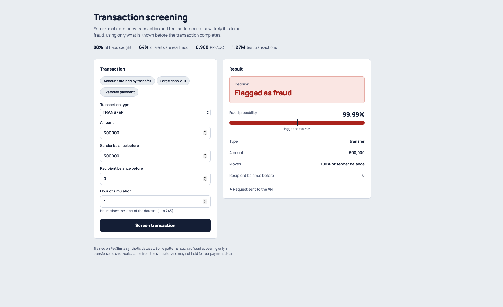
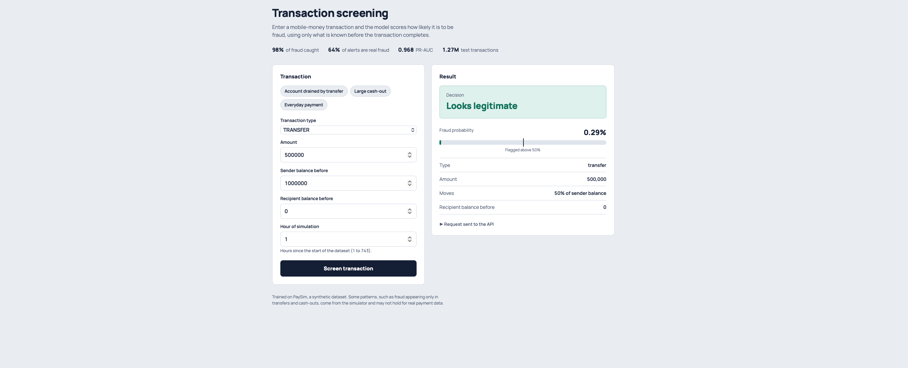

# Fraud Detection System

Detects fraudulent mobile-money transactions in 6.3M records (PaySim). The final XGBoost model catches **98% of fraud** with **64% precision** (PR-AUC 0.97), and runs as a modular Python pipeline behind a FastAPI service with a small web page for screening transactions.

## Demo

| Flagged as fraud | Looks legitimate |
|---|---|
|  |  |

The same $500,000 transfer is flagged when it empties the sender's account (99.99% fraud probability) and passes when it moves only half of the balance (0.29%).

## Results

Four approaches were compared on a stratified 80/20 split (1,272,524 test transactions, 1,643 of them fraud). Accuracy is not used, because a model that predicts "not fraud" every time already scores 99.87%.

| Model | Precision | Recall | F1 | PR-AUC |
|---|---|---|---|---|
| Logistic Regression | 0.01 | 0.83 | 0.02 | 0.038 |
| LightGBM (default settings, not tuned) | 0.01 | 0.66 | 0.02 | 0.336 |
| **XGBoost** | **0.64** | **0.98** | **0.77** | **0.968** |

XGBoost confusion matrix on the test set:

| | Predicted legitimate | Predicted fraud |
|---|---|---|
| **Actually legitimate** | 1,269,964 | 917 |
| **Actually fraud** | 26 | 1,617 |

Logistic Regression has a ROC-AUC of 0.94, which looks strong, but its PR-AUC of 0.038 and 132,946 false alarms show it is not usable. This is why PR-AUC is the main comparison metric here.

## Key findings from the data

- **Severe class imbalance.** Fraud is 0.129% of transactions.
- **Fraud only happens in two transaction types.** `TRANSFER` (4,097 cases) and `CASH_OUT` (4,116 cases). There is none in `PAYMENT`, `CASH_IN` or `DEBIT`.
- **Fraudulent transactions are larger.** Mean amount is about $1.47M against $178K for legitimate ones.
- **Fraud punches above its weight in value.** It is 0.13% of transactions by count but 1.05% of total transaction value.
- **Fraud usually empties the sender's account.** About 98% of fraud cases leave a zero balance, against about 57% of legitimate transactions.
- **The built-in `isFlaggedFraud` rule catches almost nothing**, so it is not used as a feature.

## Features and data leakage

The model uses `step`, `type` (one-hot encoded), `amount`, `oldbalanceOrg`, `oldbalanceDest` and one engineered feature, `amount_to_balance_ratio` (amount divided by the sender's balance before the transaction).

`newbalanceOrig` and `newbalanceDest` are deliberately excluded. Fraudulent transactions are cancelled, so these post-transaction balances reveal the label and would make the model look better than it is. Account IDs (`nameOrig`, `nameDest`) and `isFlaggedFraud` are also dropped.

## Project structure

```
fraud-detection-system/
├── app/
│   ├── main.py                  # FastAPI service
│   └── static/index.html        # screening web page
├── config/config.yml            # paths, columns to drop, model settings
├── fraud_detection/
│   ├── data_processing/         # loader.py, features.py
│   ├── model/                   # train.py, evaluate.py, predict.py
│   ├── pipeline/pipeline.py     # load -> features -> train -> evaluate
│   └── utils/                   # config.py, logger.py, exceptions.py
├── notebooks/                   # EDA and modeling experiments
├── trained_models/              # saved XGBoost pipeline
├── docs/                        # screenshots
└── requirements.txt
```

## Run it

1. Install dependencies:

```bash
pip install -r requirements.txt
```

2. Download the [PaySim dataset](https://www.kaggle.com/datasets/ealaxi/paysim1) and place the CSV in `data/` (the file is not in the repo because of its size).

3. Train and evaluate:

```bash
python -m fraud_detection.pipeline.pipeline
```

This saves the fitted model to `trained_models/xgboost_fraud_model.pkl`.

4. Start the API and web page:

```bash
uvicorn app.main:app --reload
```

Open `http://127.0.0.1:8000/` for the screening page, or `http://127.0.0.1:8000/docs` for the API docs.

Example request:

```bash
curl -X POST http://127.0.0.1:8000/predict \
  -H "Content-Type: application/json" \
  -d '{"step": 1, "type": "TRANSFER", "amount": 500000, "oldbalanceOrg": 500000, "oldbalanceDest": 0}'
```

## Limitations

- PaySim is synthetic. Some of what makes fraud easy to separate, such as fraud appearing only in transfers and cash-outs or the amount cap at exactly $10M, comes from the simulator and may not hold for real payment data.
- Results come from a single train/test split, without cross-validation.
- LightGBM was run with default settings. Its low score is mostly an under-tuned result, not a verdict on the method.
- Unit tests are not written yet.
